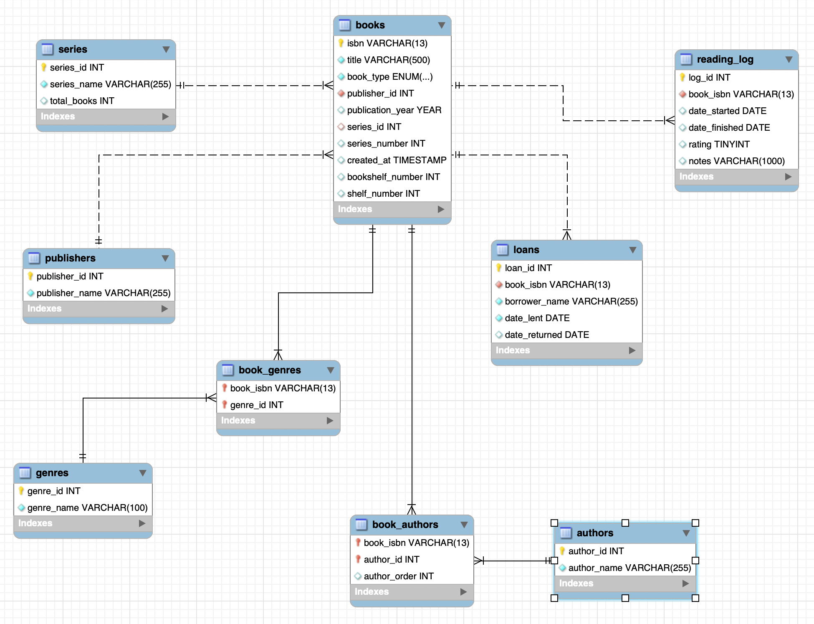

# Tera's Library Database

A personal MySQL database built to catalog and manage a personal book collection of over 1,000 books. The primary goal is to prevent duplicate purchases while also tracking reading history, ratings, book details, physical shelf location, and lending history.

---

## Why I Built This

With a collection of over a thousand books, it became difficult for my husband and I to keep track of what we already owned. This database solves that problem by providing a searchable catalog with full book details, series tracking, physical location on the shelf, a reading log, and a record of who has borrowed which books.

---

## Entity Relationship Diagram



---

## Features

- Track books by title, ISBN, publisher, publication year, and format (hardback/paperback)
- Support for multiple authors per book
- Support for multiple genres per book
- Series tracking with book order within a series, plus total book count for the series (e.g. "book 1 of 4")
- Physical location tracking — bookshelf number and shelf number for each book
- Lending tracker — records who borrowed a book, when it was lent, and when it was returned
- Reading log with start date, finish date, rating, and notes
- Re-read tracking — the same book can be logged multiple times
- Analytical queries for reading habits and collection stats

---

## Database Schema

| Table          | Description                                                                                          |
| -------------- | ----------------------------------------------------------------------------------------------------- |
| `books`        | Core book records — ISBN, title, publisher, publication year, format, series, shelf location          |
| `authors`      | Author names with unique constraint                                                                    |
| `book_authors` | Junction table linking books to one or more authors, with author order                                 |
| `genres`       | Genre names with unique constraint                                                                      |
| `book_genres`  | Junction table linking books to one or more genres                                                      |
| `publishers`   | Publisher names with unique constraint                                                                  |
| `series`       | Series names with unique constraint, plus total number of books in the series                          |
| `loans`        | Lending history — borrower name, date lent, date returned per book                                      |
| `reading_log`  | Log of each time a book was read, including dates, rating, and notes                                    |

---

## Key Design Decisions

**Many-to-many for genres:** Books often span multiple genres (e.g., Young Adult + Dystopian + Science Fiction). Rather than storing a single genre on the book, a `book_genres` junction table allows each book to have as many genres as needed.

**Many-to-many for authors:** Some books have co-authors. The `book_authors` junction table handles this, including an `author_order` column to preserve the order authors are listed on the cover.

**Series as a separate table:** Series names are stored in their own table and linked to books via a foreign key, along with a `series_number` column on `books` to track the order within a series. A `total_books` column on `series` tracks how many books exist in the series overall, so a book can display as "1 of 4," for example. For ongoing/expanding series (e.g. multi-book fantasy series still being released), `total_books` is simply updated as new installments are announced or added to the collection. Books not part of a series simply have a NULL `series_id`.

**Shelf location on books:** `bookshelf_number` and `shelf_number` columns on `books` track exactly where a physical copy lives, making it easy to walk straight to a book instead of searching shelf by shelf.

**Loans as a separate table:** Rather than storing a single "currently lent to" field on `books` (which would only track the most recent loan), lending is tracked in its own `loans` table. Each row represents one loan event with a borrower name, the date lent, and the date returned. A book is currently out on loan when a row exists with `date_returned IS NULL`. This preserves full lending history rather than overwriting it each time a book goes back out.

**Reading log supports re-reads:** Each read of a book is stored as a separate row in `reading_log`, so books read multiple times are tracked naturally without any special handling.

**Iterative development:** The schema evolved over time. The database originally stored `genre_id` and `author_id` directly on the `books` table. As the collection grew it became clear that both needed to support multiple values, so both were migrated to junction tables. Series totals, shelf location, and the loans table were added later as the same need for more detailed tracking came up. This process is documented in the project's SQL file.

---

## Sample Queries

**See all books ordered by title:**

```sql
SELECT
    b.isbn,
    b.title,
    GROUP_CONCAT(DISTINCT a.author_name ORDER BY ba.author_order SEPARATOR ', ') AS authors,
    b.book_type,
    GROUP_CONCAT(DISTINCT g.genre_name ORDER BY g.genre_name SEPARATOR ', ') AS genres,
    p.publisher_name,
    b.publication_year,
    s.series_name,
    b.series_number,
    s.total_books,
    b.bookshelf_number,
    b.shelf_number
FROM books b
LEFT JOIN book_authors ba ON b.isbn = ba.book_isbn
LEFT JOIN authors a ON ba.author_id = a.author_id
JOIN publishers p ON b.publisher_id = p.publisher_id
LEFT JOIN series s ON b.series_id = s.series_id
LEFT JOIN book_genres bg ON b.isbn = bg.book_isbn
LEFT JOIN genres g ON bg.genre_id = g.genre_id
GROUP BY b.isbn, b.title, b.book_type, p.publisher_name,
         b.publication_year, s.series_name, b.series_number,
         s.total_books, b.bookshelf_number, b.shelf_number
ORDER BY b.title;
```

**Books ordered by series, position in series, with shelf location:**

```sql
SELECT
    s.series_name,
    b.series_number,
    s.total_books,
    CASE
        WHEN s.series_name IS NOT NULL AND s.series_name != ''
        THEN CONCAT(b.series_number, ' of ', s.total_books)
        ELSE NULL
    END AS series_position,
    b.title,
    b.bookshelf_number,
    b.shelf_number
FROM books b
LEFT JOIN series s ON b.series_id = s.series_id
ORDER BY
    s.series_name IS NULL,
    s.series_name ASC,
    b.series_number ASC;
```

**Books currently lent out:**

```sql
SELECT
    b.title,
    l.borrower_name,
    l.date_lent
FROM loans l
JOIN books b ON l.book_isbn = b.isbn
WHERE l.date_returned IS NULL
ORDER BY l.date_lent;
```

**Books I have not read yet:**

```sql
SELECT
    b.title,
    GROUP_CONCAT(DISTINCT a.author_name ORDER BY ba.author_order SEPARATOR ', ') AS authors,
    s.series_name,
    b.series_number
FROM books b
LEFT JOIN book_authors ba ON b.isbn = ba.book_isbn
LEFT JOIN authors a ON ba.author_id = a.author_id
LEFT JOIN series s ON b.series_id = s.series_id
LEFT JOIN reading_log rl ON b.isbn = rl.book_isbn
WHERE rl.log_id IS NULL
GROUP BY b.isbn, b.title, b.book_type, s.series_name, b.series_number
ORDER BY s.series_name, b.series_number, b.title;
```

**Books read more than once:**

```sql
SELECT
    b.title,
    GROUP_CONCAT(DISTINCT a.author_name ORDER BY ba.author_order SEPARATOR ', ') AS authors,
    COUNT(rl.log_id) AS times_read,
    MAX(rl.date_finished) AS last_finished
FROM reading_log rl
JOIN books b ON rl.book_isbn = b.isbn
LEFT JOIN book_authors ba ON b.isbn = ba.book_isbn
LEFT JOIN authors a ON ba.author_id = a.author_id
GROUP BY b.isbn, b.title
HAVING COUNT(rl.log_id) > 1
ORDER BY times_read DESC;
```

**Most read genres:**

```sql
SELECT
    g.genre_name,
    COUNT(DISTINCT b.isbn) AS book_count
FROM books b
LEFT JOIN book_genres bg ON b.isbn = bg.book_isbn
LEFT JOIN genres g ON bg.genre_id = g.genre_id
WHERE g.genre_name IS NOT NULL
GROUP BY g.genre_name
ORDER BY book_count DESC;
```

---

## Technologies Used

- MySQL 8.0

---

## Project Status

Active — books and reading log entries are added on an ongoing basis.
